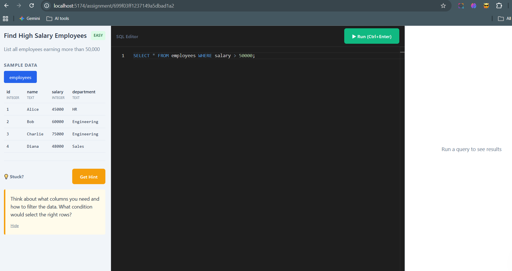
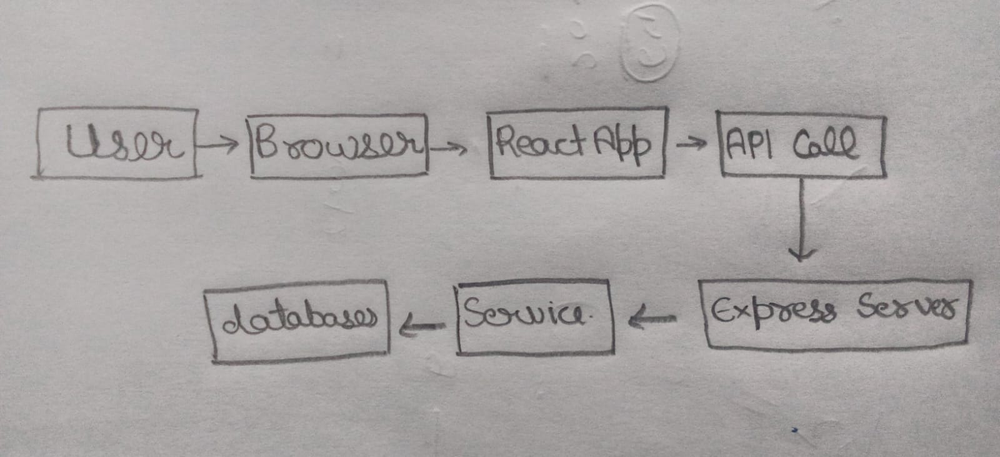

# CipherSQLStudio

A browser-based SQL learning platform where students can practice SQL queries against pre-configured assignments with real-time execution and intelligent AI hints.

##  Project Overview

CipherSQLStudio allows users to:
- View SQL assignment questions with pre-loaded sample data
- Write and execute SQL queries in a browser-based editor (Monaco Editor)
- Get intelligent hints (not solutions) from Google's Gemini AI
- See query results in real-time
- Practice on mobile or desktop (responsive design)


##  Screenshots



##  Technology Stack

### Frontend
- **React.js** (Vite) - UI framework
- **Monaco Editor** - SQL code editor (same as VS Code)
- **SCSS** - Styling with mobile-first responsive approach
- **React Router** - Navigation

### Backend
- **Node.js** + **Express.js** - API server
- **PostgreSQL** - Sandbox database for query execution (isolated schemas per session)
- **MongoDB** - Stores assignments and user progress
- **Google Gemini API** - AI hint generation

### Key Features
- **Database Isolation**: Each user gets a PostgreSQL schema, data auto-rolls back after execution
- **Security**: Query validation blocks dangerous SQL commands
- **AI Integration**: Prompt-engineered to give hints, never solutions

##  Project Structure

```text
CipherSQLStudio/
├── backend/
│ ├── config/ # Database connections
│ ├── models/ # MongoDB schemas
│ ├── routes/ # API endpoints
│ ├── services/ # Business logic (LLM, Query execution)
│ ├── utils/ # Seed data
│ ├── .env.example # Environment template
│ └── server.js # Entry point
├── frontend/
│ ├── src/
│ │ ├── components/ # React components
│ │ ├── pages/ # Route pages
│ │ ├── services/ # API calls
│ │ └── styles/ # SCSS files
│ ├── .env.example # Environment template
│ └── index.html
├── data-flow-diagram.png # Hand-drawn diagram (required)
└── README.md
```

## ⚙️ Installation & Setup

### Prerequisites
- Node.js 18+
- PostgreSQL 14+
- MongoDB (local or Atlas)
- Google Gemini API key (free from [ai.google.dev](https://ai.google.dev))

### 1. Clone Repository
```bash
git clone 
cd CipherSQLStudio
```

### 2. Backend Setup
```bash
cd backend
cp .env.example .env
# Edit .env with your credentials
npm install
npm run seed      # Load sample assignments into MongoDB
npm run dev       # Starts on http://localhost:5000
```
#### Backend .env variables:
```text
PORT=5000
PG_HOST=localhost
PG_PORT=5432
PG_DATABASE=ciphersqlstudio
PG_USER=postgres
PG_PASSWORD=your_postgres_password
MONGODB_URI=mongodb://localhost:27017/ciphersqlstudio
MONGODB_DB_NAME=ciphersqlstudio
GEMINI_API_KEY=your_gemini_api_key_here
```
### 3. Frontend Setup
```bash
cd frontend
cp .env.example .env
npm install
npm run dev       # Starts on http://localhost:5174
```
#### Frontend .env variables:
```text
VITE_API_URL=http://localhost:5000
```
### 4. Verify Installation
- Backend health check: http://localhost:5000/api/health
- Frontend: http://localhost:5174
- You should see 4 pre-loaded assignments

## Data Flow Architecture


See data-flow-diagram.png (hand-drawn) for visual representation.


### Query Execution Flow:
- User writes SQL query → clicks "Execute"
- Frontend sends POST to /api/execute with query + sessionId
- Backend receives request, validates query against blocked keywords
- PostgreSQL Service creates isolated schema (workspace_sessionId)
- Setup inserts sample data tables for this assignment
- Execute runs user's query within transaction
- Rollback transaction (ensures no persistent changes)
- Return results or error to frontend
- Frontend displays results in table format or error message

### Hint Generation Flow:
- User clicks "Get Hint"
- Frontend sends POST to /api/hints with assignmentId, query, any error
- Backend fetches assignment details from MongoDB
- LLM Service crafts prompt with rules: "NEVER give SQL, only hints"
- Gemini API returns guidance
- Backend returns hint to frontend
- Frontend displays hint in hint panel
---
## Security Measures
- Schema Isolation: Each user session gets separate PostgreSQL schema
- Transaction Rollback: All queries run in transactions that rollback
- Query Validation: Blocks DROP DATABASE, CREATE USER, system table access
- Input Sanitization: Prevents SQL injection patterns

## Mobile-First Design
- Breakpoints: 320px (mobile), 641px (tablet), 1024px+ (desktop)
- Touch-friendly targets: minimum 44px
- Responsive grid layouts using CSS Grid and Flexbox
- Monaco Editor works on mobile with optimized settings

## Sample Assignments Included
- Find High Salary Employees (Easy) - Basic WHERE clause
- Department-wise Employee Count (Medium) - GROUP BY
- Total Order Value per Customer (Medium) - JOIN operations
- Highest Paid Employee (Hard) - Subqueries/MAX

## Contributing
This project was built as an educational assignment. The focus is on demonstrating:

- Full-stack JavaScript development
- Database design and security
- Third-party API integration (LLM)
- Responsive UI/UX design
- Clean code architecture

## License
MIT License - Built for educational purposes.
